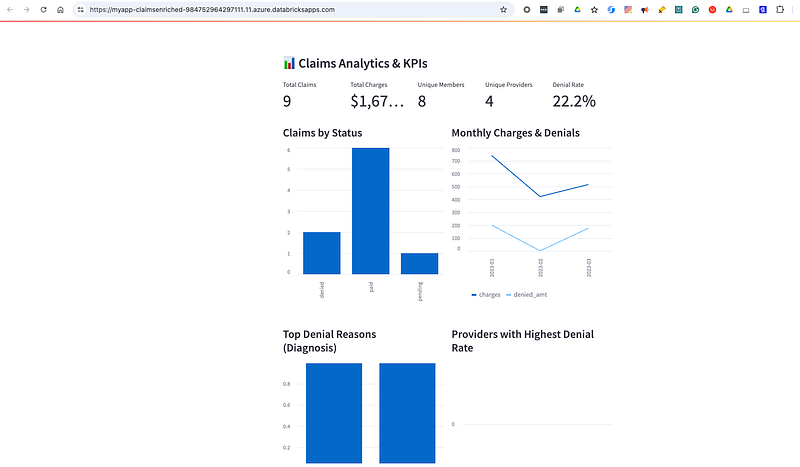

**Production analytics app for healthcare payer claims, powered by Databricks Lakebase and Streamlit**

***

## Overview

This project provides a Databricks-native analytics app for healthcare payer claims, built on **Databricks Lakebase** (managed Postgres with lakehouse-native features). It ingests the enriched claims data from the [payer_dlt](https://github.com/bigdatavik/payer_dlt) medallion pipelines (bronze, silver, gold, Lakeflow sync), exposing secure, interactive dashboards—all within Databricks.

- **Data Source:** Consumes the final claims enriched (`claims_enriched`) table prepared by the [payer_dlt](https://github.com/bigdatavik/payer_dlt) project.
- **Architecture:** Gold/Silver/Bronze Medallion Tables → Lakeflow Sync (Reverse ETL) → Lakebase Postgres → Production App.
- **Features:**  
  - Real-time KPIs and trend analytics  
  - Secure Postgres connection using Lakebase short-lived credentials  
  - Lakehouse-native governance with Unity Catalog and managed access  
  - Extendable with Python or Streamlit  
 
***

## Architecture


- Access to an Azure Databricks workspace with **Lakebase** enabled and Unity Catalog configured
- The [payer_dlt](https://github.com/bigdatavik/payer_dlt) pipelines completed, with the `claims_enriched` gold table populated in Unity Catalog and eligible for Lakeflow sync
- Your workspace/service principal has privilege to provision apps, sync tables, and manage Lakebase

***

## Setup and Deployment

### 1. Sync Claims Table to Lakebase

- Use Lakeflow or the Databricks UI to **sync the `claims_enriched` table** from the gold schema into your Lakebase instance.
- For steps to provision the lakebase PostgreSQL database in Databricks see my [Medium blog](https://medium.com/@vikram.malhotra/how-to-build-a-databricks-analytics-app-on-lakebase-from-setup-to-insights-89275e37e6eb) 
- Register the synced Lakebase database/catalog in Unity Catalog for access and governance.


### 2. Clone and Deploy the App from Databricks UI

- In Databricks, go to the **Repos** tab.
- Click **Add Repo** or **Clone Repo** and enter:
  ```
  https://github.com/bigdatavik/payer-app-lakebaseapp.git
  ```
- Once cloned, go to **Compute > Apps**.
- Click **Create new app**, choose **Create a custom app**, then point to your cloned repo folder.


- Set any required environment variables for your Lakebase Postgres connection (can be from generated creds via the Databricks SDK, secrets, or Databricks env UI).
- Complete the app wizard and launch.


### 3. Using the App

- Once deployed, access the app from your Databricks Apps section.
- Explore interactive dashboards and filter claims data in real time.



***

## Notes

- **Credential Rotation:** Lakebase credentials typically expire every 15 minutes. The app supports refreshing; see code for patterns.
- **Security/Compliance:** Access is governed via Unity Catalog and Lakebase privileges. All changes or views are audit-logged within Databricks.
- **Customization:** Add new charts, filters, or business logic by editing/adding Streamlit components within the repo.

***

## Troubleshooting

- **Permission Denied**: Confirm the app/service principal has SELECT privilege on the synced claims table in Lakebase.
- **Lakebase Connectivity**: Ensure your instance is running and you are using valid (fresh) credentials.
- **psql not found**: Install the PostgreSQL client if local troubleshooting/debug is needed.


## Running Locally

Run this app from your own machine with secure, short-lived Databricks Lakebase credentials:

### 1. Clone the Repo

```bash
git clone https://github.com/bigdatavik/payer-app-lakebase.git
cd payer-app-lakebase
```

***

### 2. Find Your Lakebase Connection Details

You'll need several database parameters from your Databricks workspace:

1. **Open Databricks Workspace** in your browser.
2. Go to **Compute > Database Instances**, then select your Lakebase instance (e.g., "myapp").
3. Click on the **Connection details** tab.
4. Copy the following fields:
    - **Host** – for `PGHOST`
    - **User** – for `PGUSER`
    - **Database** – for `PGDATABASE`
    - **Port** – for `PGPORT` (usually `5432`)
    - **SSL Mode** – for `PGSSLMODE` (usually "require")
5. Paste these values into your `set_pg_env.sh` script (leave `PGPASSWORD` logic as is).

- [Official Lakebase docs (Azure)](https://learn.microsoft.com/en-us/azure/databricks/oltp/)

***

### 3. Edit and Source the Environment Script

- Open `set_pg_env.sh` in a text editor and update the variables above.
- The script will generate your secure, short-lived Lakebase token at runtime—**do not hardcode a password**.
- To set all variables for your session, run:

```bash
source set_pg_env.sh
```

***

### 4. Install Prerequisites

#### Databricks CLI

- [Databricks CLI documentation](https://learn.microsoft.com/en-us/azure/databricks/dev-tools/cli/)
- Install:
  ```bash
  pip install databricks-cli
  ```
- **Authenticate using OAuth (U2M):**
  ```bash
  databricks auth login --host https://<your-databricks-instance>
  ```
  - Follow browser prompts to log in.
  - Credentials are stored securely for subsequent CLI use.
  - More details: [Databricks CLI authentication](https://learn.microsoft.com/en-us/azure/databricks/dev-tools/cli/authentication#u2m-auth)

#### jq

- [jq Download and Install Guide](https://stedolan.github.io/jq/download/)
- macOS: `brew install jq`
- Ubuntu/Debian: `sudo apt-get install jq`
- Windows: Use the download links above.

#### Python Requirements

- Install Python packages:
  ```bash
  pip install -r requirements.txt
  ```

***

### 5. Run the App

```bash
streamlit run app.py
```
- Open [http://localhost:8501](http://localhost:8501) in your browser.

***

### Troubleshooting

- **Token Expiry:** Lakebase credentials expire every ~15 minutes. Re-run `source set_pg_env.sh` and restart the app if you lose your connection.
- **CLI/jq Errors:** If you see "command not found: databricks" or "jq", install those tools or ensure they are on your PATH.
- **Authorization Errors:** Make sure your Databricks user has permission to generate credentials for the Lakebase instance.

***

**Documentation Links**

- [Lakebase overview & setup](https://learn.microsoft.com/en-us/azure/databricks/oltp/)
- [Databricks CLI guide](https://learn.microsoft.com/en-us/azure/databricks/dev-tools/cli/)
- [CLI authentication (OAuth, U2M)](https://learn.microsoft.com/en-us/azure/databricks/dev-tools/cli/authentication#u2m-auth)
- [jq command-line tool](https://stedolan.github.io/jq/download/)

***


## Related Projects

- [payer_dlt](https://github.com/bigdatavik/payer_dlt): Gold/silver/bronze ETL pipelines, source of transformation and enrichment  
- [Databricks Lakebase Documentation] (https://learn.microsoft.com/en-us/azure/databricks/oltp/)  


*Move from data pipeline to production BI in hours, not weeks—with Databricks Lakebase and this app template!*
